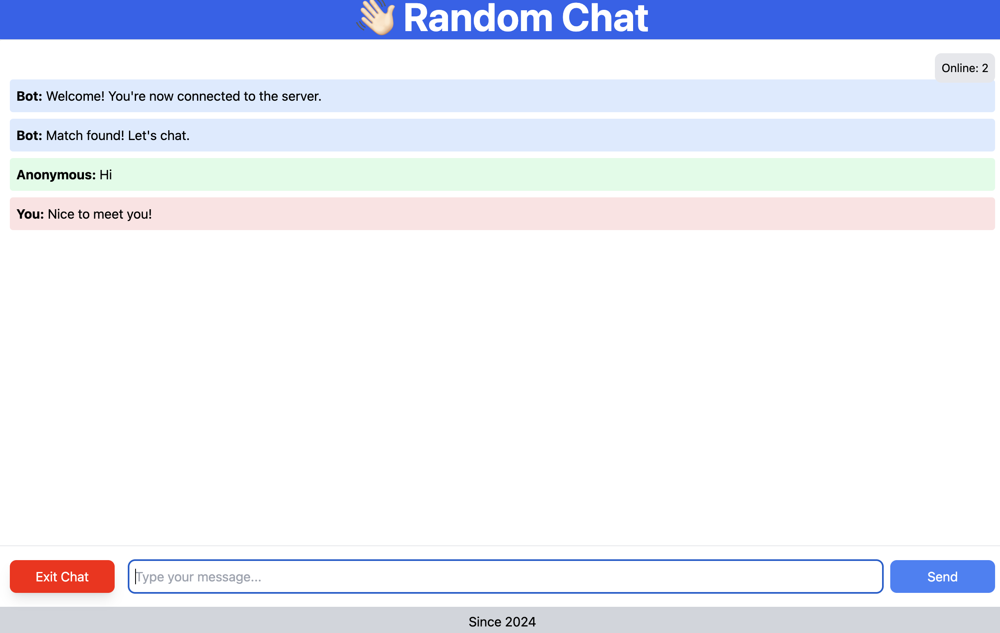

# RandomChat
- Connecting with anonymous user in the server.



## How to run

### Frontend
1. go to `frontend` directory
2. install node packages

```bash
npm i
```

3. run Vite application
```bash
npm run dev
```

### Backend
1. go to `backend` directory
2. build jar file
```bash
./mvnw clean package
```
3. run jar file
```bash
java -jar ./target/backend-1.0.0.jar
```